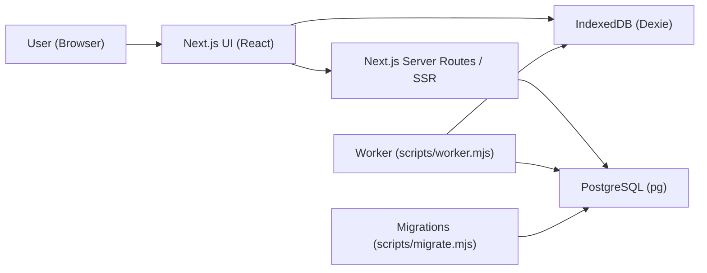

# Architecture Overview

Key building blocks inferred from `package.json`:
- Next.js app (`pnpm dev`)
- Client-side offline storage (Dexie / IndexedDB)
- PostgreSQL connectivity (`pg`)
- Node scripts: `migrate` and `worker`

## Data Flow (Conceptual)

Notes:
- This diagram is intentionally high-level; the exact runtime boundaries (what runs in browser vs. Node) depend on how `app/` is implemented.
- If the app uses Next.js Route Handlers, the "API" box maps to those handlers.
- If the worker does sync, it typically reconciles between IndexedDB state and PostgreSQL state.

## Suggested Next Documentation Pass

- Confirm where DB connection is established (search for `pg`, `Pool`, connection strings).
- Confirm where Dexie schema is defined (search for `new Dexie`, `.version(...)`, `.stores(...)`).
- Map actual routes / pages from `app/` to the diagram.
