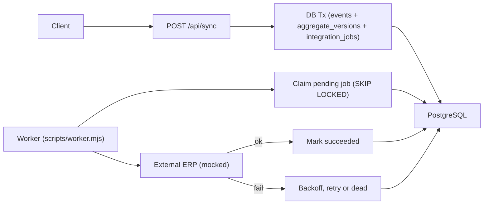

# Architecture Overview

Key building blocks:
- Next.js app (API routes + UI)
- PostgreSQL persistence (`pg`)
- Transactional event ingestion + integration queue (server-side)
- Background worker with retry/backoff + DLQ (dead jobs)

## Data Flow (Actual)

Notes:
- `/api/sync` persists accepted domain events and enqueues integration work in the same transaction.
- The worker polls and processes jobs asynchronously with exponential backoff and a dead-letter state (`dead`).

## Suggested Next Documentation Pass

- Add an "API reference" table for `/api/sync`, `/api/integration-jobs`, `/api/integration-jobs/retry`.
- Describe the event model (`events`, `aggregate_versions`) and job model (`integration_jobs`).
- Document environment variables and Docker compose setup.
